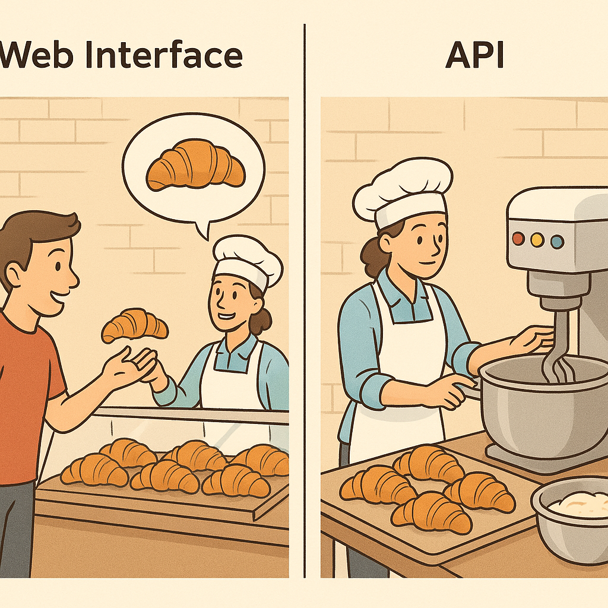

# Why Use LLM APIs Instead of Web Interfaces?

## The Question

Why should we bother accessing an LLM via an API when I can just use ChatGPT, Claude, or Gemini in a browser?

## The Simple Answer

Using LLMs via a web interface is like going to a bakery and ordering one croissant. Tastes great! But what if you want to bake croissants at scale, on your schedule, and add your own fillings?

That's what APIs allow. APIs let you take the magic behind ChatGPT and plug it directly into your own tools, workflows, and apps.

## Real-World Examples

### 1. Resume Review Tool

Imagine you're building a resume analyzer that reads a resume PDF and gives instant feedback.
- **With Web Interface**: You'd have to copy-paste every resume manually
- **With API**: You can write a script that reads the PDF, sends it to the model, and gets structured feedback — all automatically

### 2. Daily Meeting Summary

Let's say your team wants an automatic summary of every Zoom call. The transcript gets saved to a folder, and within 30 minutes, a summary appears in Slack.

**Web interface?** Can't help you.

**But with the API**, you can automate:
- Reading the transcript
- Sending it to the LLM
- Formatting the summary
- Posting it in Slack

And all of this happens while you're making coffee.

### 3. Chatbot in Your Website

Let's say you want a chatbot on your site that can answer questions about your company's products — 24/7.

You can't do this with the ChatGPT web interface. But you can with the API — because now the model is part of your system, running behind the scenes.

## Key Advantages of Using APIs

1. **Automation**: No more manual copy-pasting
2. **Scalability**: Process 1 or 10,000 prompts — your choice
3. **Integration**: Bring AI into your own apps, tools, workflows
4. **Customization**: Control the tone, format, structure, and cost

## Bottom Line

Web interfaces are great for one-off chats. But if you want to build something, scale something, or automate something — APIs are the way to go.